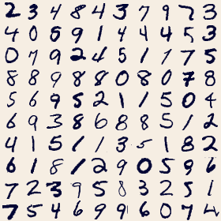
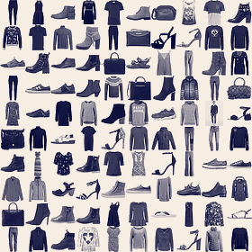
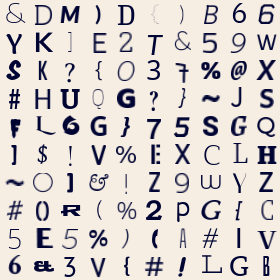
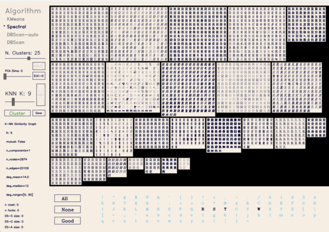
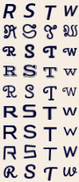
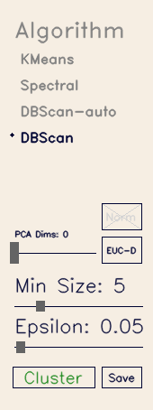
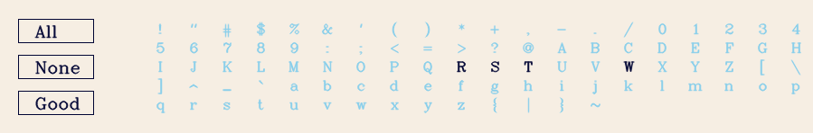
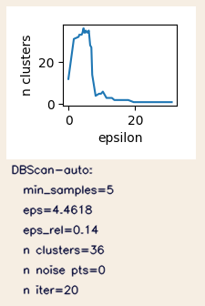
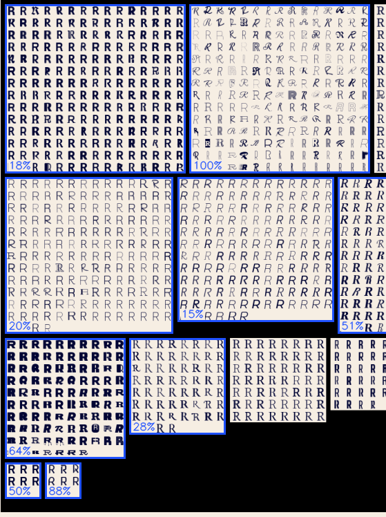
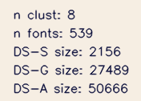

# Autoencoders, Variational and Dense

Explore dense and sparse encodings of digit images.
Interpolate in the latent space, decode and visualize.

## Datasets

### MNIST

Dataset statistics:
- 70,000 grayscale images of handwritten digits (0-9, 7,000 each)
- Each image is 28x28 pixels, automatically centered/scaled


### Fashion-MNIST
Dataset statistics:`
- 70,000 grayscale images of 10 fashion categories, (T-shirts, trousers, pullovers, dresses, coats, sandals, shirts, sneakers, bags, and ankle boots) (7,000 each)
- (same size / preprocessing as MNIST)



### Typography-MNIST

Dataset statistics:
- 2,990 typefaces, each with 94 grayscale images (total 280,060 images)
- (same size / preprocessing as MNIST)



#### Data References

Y. LeCun, C. Cortes, and C. J. C. Burges. *MNIST handwritten digit database.* link: http://yann.lecun.com/exdb/mnist/ 

Han Xiao, Kashif Rasul, Roland Vollgraf. *Fashion-MNIST: a Novel Image Dataset for Benchmarking Machine Learning Algorithms.* arXiv: https://arxiv.org/abs/1708.07747

Magre, N., & Brown, N. M. (2022). *Typography-MNIST (TMNIST): an MNIST-Style Image Dataset to Categorize Glyphs and Font-Styles.* arXiv: https://arxiv.org/abs/2202.08112 


## Clustering Typefaces

Ideally there would be a wide diversity of typefaces with no particular style overly represented. However, the dataset contains many typefaces that are very similar, and some styles (e.g. sans-serif) are much more common than others.

We can use clustering to find groups of similar typefaces and select clusters to create a training set for autoencoders.


Run the script `> python cluster_fonts.py` to open the typeface clustering GUI:



The left column shows the control panel, the algorithm statistics, and the projected dataset size (top to bottom).

The bottom shows a set of buttons to select which characters to include in the data vectors.

The large center panel shows the clusters found by the selected algorithm.  Each cluster is represented by a grid of character images, using one of the characters from the data vectors.

The following settings are shown in the example image:
 * pca dims: 0 (no dimensionality reduction)
 * algorithm: Spectral clustering
 * number of clusters: 25
 * similarity-graph KNN: 9

### Algorithm

##### Data Preparation: 
For each of the 2,990 typefaces, create a vector by concatenating a subset of the 94 character images into a single long vector of pixel intensities.  Each 28x28 image is flattened to a vector of length 784, and concatenating 4 characters produces a vector of length 3,136, etc.



#### Control panel

At the top of the control panel is a selectable list of available clustering algorithms.  Below it are sliders and buttons for its parameters.


##### Dimensionality Reduction using PCA
if the "PCA Dims" slider is set to a value > 0, then PCA is applied to reduce the dataset to that many dimensions.  PCA can only be used if the number of dimensions is less than the number of samples (2,990).

#### Character selection

Click a character directly to set which characters are used, or click the "None" "All" or "Good" buttons to select a preset group of characters.  (The so-called **good characters** do not result in blurry images after being processed into the MNIST format.)




NOTE:  Clustering with more than 3 characters cannot use PCA (TODO: Fix this), so it may be slow.

#### Clustering summary

Below the control area is a summary of results that displays after "Cluster" is clicked.




This is the example output using DBScan-auto, which does a parameter sweep over epsilon to find the most clusters with reqired minimum cluster size (5 here).  It found 36 clusters using an epsilon of 4.46 (or 0.14 relative to the total range).  The graph shows the number of clusters found as a function of epsilon.

#### Clustering results / selection

The main panel shows the clusters found by the selected algorithm.  Each cluster is represented by a single character from all the typefaces in that cluster, arranged in a grid. 

Click a cluster and drag the mouse up/down to increase/decrase its indicated fraction.  Dragging to 0 de-selects the cluster.  The fraction indicates what portion of the typefaces in that cluster will be included in the training set.  The least prototypical typefaces are used first to create a more diverse training set.




This example shows eight clusters selected for inclusion in the training set (with the blue box and percentage indicated.)  Within each cluster, samples are sorted (from left to right then top to bottom) by their "distance" from the cluster center:
  * K-means:  Euclidean/Cosine distance from the cluster centroid
  * DBScan: Distance from the nearest core point, or 0 for the noise points
* Spectral:  New points are assigned to the same cluster as their closest neighbor in the training set, distances are that neighbor's distance to the cluster centroid in eigenfeature space.


#### Dataset size

Below the clustering summary shows the projected dataset size, based on which clusters are selected and what fraction is indicated for each. 



This example shows that, with clusters selected as above, there are 539 typefaces included, and the dataset will have:
  * DS-S (dataset of selected chars): 2,156 images using the selected 4 characters "R, S, T, W"
  * DS-G (dataset of good chars): 27,489 images using the "Good" character set (51 characters)
  * DS-A (dataset of all chars): 50,666 images using all 94 characters.

When you have enough points, click the "Save" button.  This will create the file `font_set.json` that can be used as an input to auto encoder training scripts (`dense.py`, `vae.py`)  and the file `font_chars.png` showing the selected characters from all the selected typefaces.

The internal structure of `font_set.json` is:
```
{ "charset": [list of selected characters],
  "clusters": [ {"font_names": [list of typeface names in the cluster]}]
}
```

# Autoencoder Training - Learn Latent Representations
[Autoencoders background info]
## Dense Autoencoder
[bagkround for this application.]
```
usage: vae.py [-h] [--dataset DATASET] [--pca_dims PCA_DIMS] [--whiten] [--dropout_layer DROPOUT_LAYER] [--batch_size BATCH_SIZE] [--d_latent D_LATENT] [--dropout_rate DROPOUT_RATE]
              [--layers LAYERS [LAYERS ...]] [--epochs EPOCHS] [--stages STAGES] [--learn_rate LEARN_RATE] [--no_plot] [--dec_layers DEC_LAYERS [DEC_LAYERS ...]] [--binary_input] [--reg_lambda REG_LAMBDA]

Train a variational autoencoder on MNIST data.

options:
  -h, --help            show this help message and exit
  --dataset DATASET     Which dataset to use: 'digits' (MNIST, handwritten digits), 'fashion' (Fashion-MNIST), 'numeric' (Typeface-MNIST), 'alphanumeric' (94_character_TMNIST), <font_set.json> (custom font
                        set from TMNIST, output of cluster_font.py)
  --pca_dims PCA_DIMS   PCA-preprocessing:[=0, whitening, no pca] / [int>0, number of PCA dims] / [0<float<1, frac of variance to keep]
  --whiten              If set, each PCA feature is z-scored, else will have its original distribution.
  --dropout_layer DROPOUT_LAYER
                        Which encoding layer uses dropout (index into --layers param, cannot be final/coding layer)
  --batch_size BATCH_SIZE
                        Batch size for training (Default 256)
  --d_latent D_LATENT   Dimensionality of the latent space (default: 16)
  --dropout_rate DROPOUT_RATE
                        Dropout rate to apply after each dense layer (default: 0.0)
  --layers LAYERS [LAYERS ...]
                        List of encoder layer sizes (default, 1 layers: [64])
  --epochs EPOCHS       Number of epochs to train each stage (default: 25)
  --stages STAGES       Number of times to train for the number of epochs, generate plots between each (default: 1)
  --learn_rate LEARN_RATE
                        Learning rate for the optimizer (default: 1e-3)
  --no_plot             If set, saves images instead of showing them interactively.
  --dec_layers DEC_LAYERS [DEC_LAYERS ...]
                        List of decoder layer sizes (default: None, encoding layers reversed)
  --binary_input        If set, binarizes the input images (default: False)
  --reg_lambda REG_LAMBDA
                        Regularization parameter for VAE (default: 0.01)
```
*to be continued...*

# 2D Embedding of Latent Representations

Run the script `> python embed.py <weights_file>` to create a 2D embedding of the latent representations of the training set images.  This will create two files for each embedding method in the local `embeddings/` subdirectory:
  * `<weights_file>.embed-<EMB_METHOD>.pkl` - the embedding, for use in the latent distribution explorer.
  * `<weights_file>.embed-<EMB_METHOD>.pkl.map.png` - a large rendering of the embedding, with images drawn at their 2D locations.

  The embedding methods are set in `embed.py::38`, currently:
  ```
  EMBEDDINGS = [PCAEmbedding, TSNEEmbedding, UMAPEmbedding]
  ```

  [ADD EXAMPLE IMAGES]


  # Latent Distribution Explorer

Run the script   `> python explore_latent.py <embedding_file>.pkl` to start the latent distribution explorer GUI: